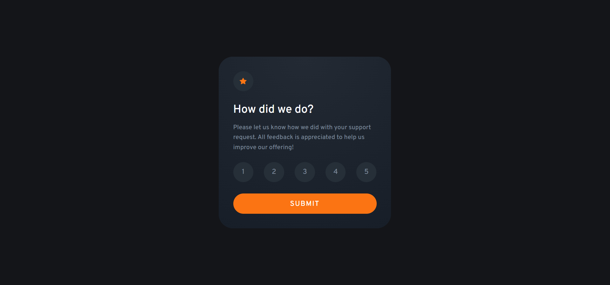
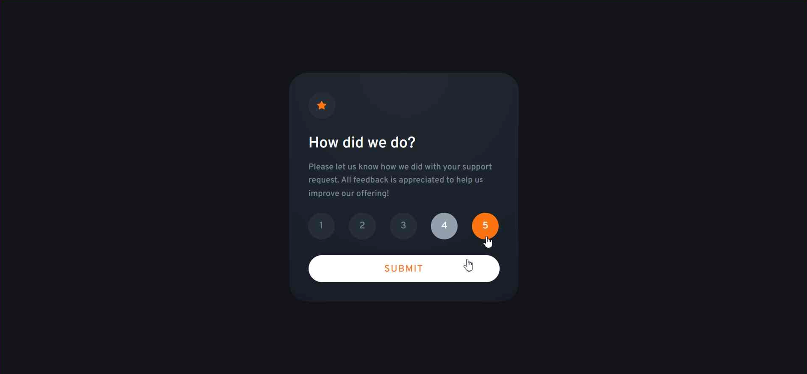
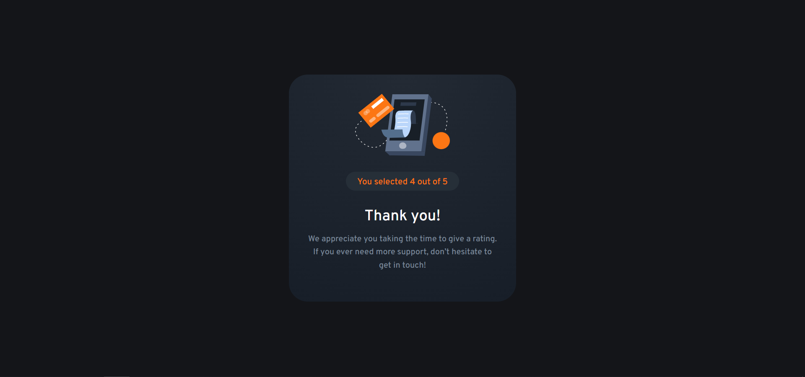

# Frontend Mentor - Interactive rating component solution

This is a solution to the [Interactive rating component challenge on Frontend Mentor](https://www.frontendmentor.io/challenges/interactive-rating-component-koxpeBUmI). Frontend Mentor challenges help you improve your coding skills by building realistic projects. 

## Table of contents

- [Overview](#overview)
  - [The challenge](#the-challenge)
  - [Screenshot](#screenshot)
  - [Links](#links)
- [My process](#my-process)
  - [Built with](#built-with)
  - [What I learned](#what-i-learned)
  - [Continued development](#continued-development)
  - [Useful resources](#useful-resources)
- [Author](#author)

## Overview

### The challenge

Users should be able to:

- View the optimal layout for the app depending on their device's screen size
- See hover states for all interactive elements on the page
- Select and submit a number rating
- See the "Thank you" card state after submitting a rating

### Screenshot
Desktop


Active states


Thank You!


### Links

- Solution URL: [here](https://celadon-mochi-c6df84.netlify.app/)

## My process

### Built with

- Semantic HTML5 markup
- CSS3
- JavaScript
- CSS Grid
- CSS media queries
- CSS animation library
- JS Promise

### What I learned
Using JS Promise to prevent state changes during the animation
```js
  new Promise((resolve) => {
    const submit = document.querySelector('.submission');
    submit.classList.add("animate__animated", "animate__shakeX");
    function handleAnimationEnd() {
      submit.classList.remove("animate__animated", "animate__shakeX");
      resolve('Animation ended');
    }
    submit.addEventListener('animationend', handleAnimationEnd, {once: true});
  });
```

### Continued development

Use this section to outline areas that you want to continue focusing on in future projects. These could be concepts you're still not completely comfortable with or techniques you found useful that you want to refine and perfect.

**Note: Delete this note and the content within this section and replace with your own plans for continued development.**

### Useful resources

- [Animate.css](https://animate.style/) - The JS example from here helped me solve the problem with the submit button animation, which was interrupted if pressed too often. I really liked this pattern and will use it going forward.

## Author

- Frontend Mentor - [@serjunya](https://www.frontendmentor.io/profile/serjunya)
- VK - [@golovogay](https://www.vk.com/golovogay)
